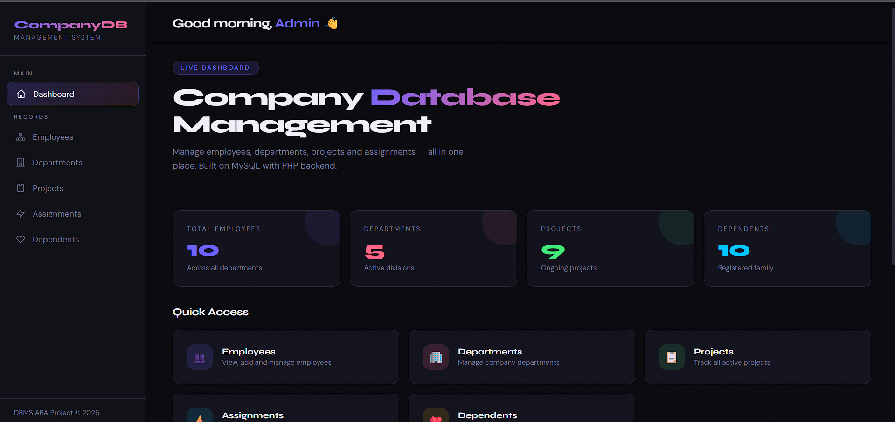
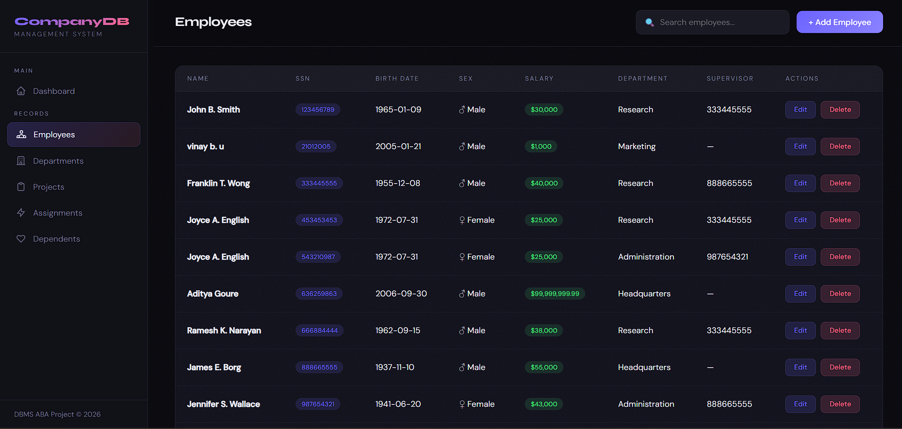
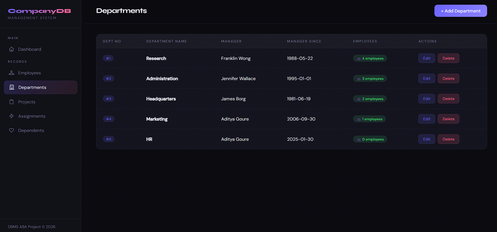
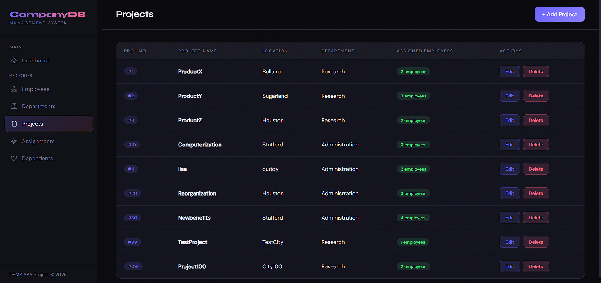
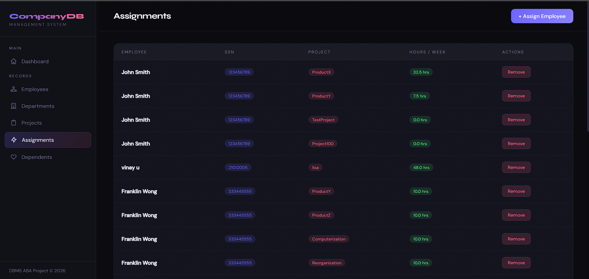
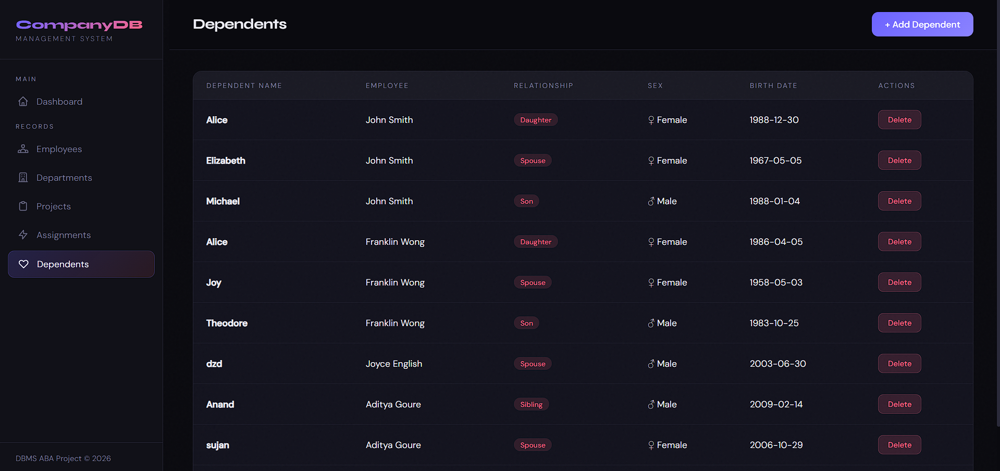

# 🏢 CompanyDB — Database Management System

A modern, full-stack **Company Database Management System** built with HTML, CSS, JavaScript, and PHP (MySQL). Manage employees, departments, projects, assignments, and dependents through a sleek dark-themed dashboard.


---

## ✨ Features

- **📊 Live Dashboard** — Real-time stats for employees, departments, projects, and dependents
- **👥 Employee Management** — Add, edit, delete, and search employee records
- **🏢 Department Management** — Manage departments with manager assignment and locations
- **📋 Project Management** — Track projects with department associations
- **⚡ Work Assignments** — Assign employees to projects with hours tracking
- **❤️ Dependents** — Manage employee family/dependent records
- **🔍 Search & Filter** — Instant search across all record tables
- **🎨 Modern Dark UI** — Glassmorphism, smooth animations, and responsive design

---

## 🗂️ Project Structure

```
company_project/
├── index.html              # Dashboard (home page)
├── employees.html          # Employee management page
├── departments.html        # Department management page
├── projects.html           # Project management page
├── works_on.html           # Work assignments page
├── dependents.html         # Dependents management page
├── style.css               # Global stylesheet (dark theme)
├── company_db_export.sql   # Database schema + sample data
├── api/
│   ├── db.php              # Database connection (not tracked — see setup)
│   ├── db.php.example      # Template for db.php (copy & configure)
│   ├── employees.php       # Employee CRUD API
│   ├── departments.php     # Department CRUD API
│   ├── projects.php        # Project CRUD API
│   ├── works_on.php        # Assignments CRUD API
│   └── dependents.php      # Dependents CRUD API
├── .gitignore
└── README.md
```

---

## 🚀 Getting Started

### Prerequisites

- [XAMPP](https://www.apachefriends.org/) (or any Apache + MySQL + PHP stack)
- A web browser

### Installation

1. **Clone the repository**
   ```bash
   git clone https://github.com/YOUR_USERNAME/company_project.git
   ```

2. **Move to your web server directory**
   ```bash
   # For XAMPP on Windows:
   # Copy/clone into C:\xampp\htdocs\company_project
   ```

3. **Set up the database**
   - Start **Apache** and **MySQL** from the XAMPP Control Panel
   - Open [phpMyAdmin](http://localhost/phpmyadmin)
   - Create a new database named `company_db`
   - Import `company_db_export.sql` into the database

4. **Configure database connection**
   ```bash
   cd api
   cp db.php.example db.php
   ```
   - Open `api/db.php` and fill in your MySQL credentials
   - For default XAMPP: username = `root`, password = (empty), port = `3306` or `3307`

5. **Open in browser**
   ```
   http://localhost/company_project/
   ```

---

## 🗄️ Database Schema

The application uses a relational database with the following tables:

| Table | Description |
|---|---|
| `employee` | Employee records (SSN, name, salary, department, supervisor) |
| `department` | Departments (number, name, manager, start date) |
| `dept_locations` | Department office locations |
| `project` | Projects (number, name, location, department) |
| `works_on` | Employee-project assignments with hours |
| `dependent` | Employee dependents (family members) |

### ER Relationships
- Each **employee** belongs to one **department**
- Each **department** has one **manager** (an employee)
- **Employees** are assigned to **projects** via `works_on`
- Each **employee** can have multiple **dependents**

---

## 🛠️ Tech Stack

| Layer | Technology |
|---|---|
| Frontend | HTML5, CSS3, JavaScript (Vanilla) |
| Backend | PHP (REST-style API) |
| Database | MySQL (via `mysqli`) |
| Fonts | [Syne](https://fonts.google.com/specimen/Syne), [DM Sans](https://fonts.google.com/specimen/DM+Sans) |
| Server | Apache (XAMPP) |

---

## 📡 API Endpoints

All API endpoints are in the `api/` directory and accept `action` as a query parameter:

| Endpoint | Actions |
|---|---|
| `api/employees.php` | `get_all`, `create`, `update`, `delete` |
| `api/departments.php` | `get_all`, `create`, `update`, `delete` |
| `api/projects.php` | `get_all`, `create`, `update`, `delete` |
| `api/works_on.php` | `get_all`, `create`, `update`, `delete` |
| `api/dependents.php` | `get_all`, `create`, `update`, `delete` |

---

## 📸 Screenshots

### Dashboard


### Employees


### Departments


### Projects


### Assignments


### Dependents


---

## 📄 License

This project is open source and available under the [MIT License](LICENSE).

---

## 👥 Authors

**DBMS ABA Project** © 2026
